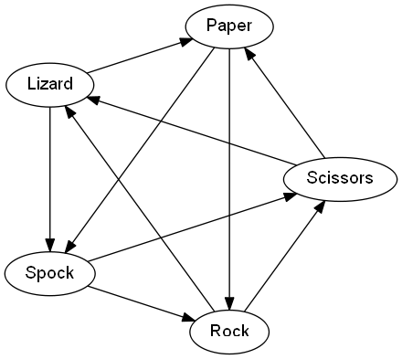

# rock-paper-scissors-lizard-spock

Most people probably know the game rock-paper-scissors where two players count down and simultaneously form either a rock (fist), a pair of scissors (two outstretched fingers) or a piece of paper (outstretched hand) with their hands.
## How many outcomes are there in Rock Paper Scissors Lizard Spock?

The values of a, b, and c may each be chosen independently to be 1 or -1. If b + c = 0, then d can be chosen freely. Otherwise b and c have the same sign, and d must have the opposite sign. So all together there are 12 possibilities (6 if you insist a = 1)

## the final result of game 

.png)

[Check this to play ](https://galalkoro.github.io/rock-paper-scissors-lizard-spock/)